# 职高教学管理系统

[](LICENSE)
[](backend/pom.xml)
[](frontend/package.json)
[](https://github.com/mvpflk/teaching-system/actions/workflows/ci.yml)
[](https://github.com/mvpflk/teaching-system)

面向中职学校的免费开源教学管理系统。含 AI 智能出题、智能批改、OCR 答题卡识别、成绩分析与知识图谱等功能。一线教师从零开发，已在真实课堂投入使用。

---

## 功能

| 模块 | 说明 |
|------|------|
| ✅ 任务管理 | 作业/考试/实训的发布、提交、批改全流程 |
| ✅ AI 智能出题 | 输入知识点，AI 自动生成多题型试卷 |
| ✅ AI 诊断报告 | 分析学生薄弱知识点，生成个性化学习建议 |
| ✅ OCR 答题卡批改 | 拍照识别手写答案，自动评分 |
| ✅ 成绩分析 | 每题得分率、分数分布、趋势图 |
| ✅ 知识图谱 | 按知识点追踪全班掌握度，红色=薄弱点 |
| ✅ 积分系统 | 签到、行为奖励、商城兑换 |
| ✅ 课堂互动 | 随堂练习、实时统计 |
| ✅ 错题本 | 自动收录错题，支持重练 |
| ✅ 家长端 | 查看孩子成绩和作业情况 |

## 技术栈

```
后端：Spring Boot 3.2 + Java 17 + MyBatis-Plus + Flyway
前端：Vue 3 + Vite + Element Plus
AI：DeepSeek API（智能出题/评分/OCR）
部署：Docker Compose（MySQL + Redis + Nginx）
监控：Prometheus + Grafana + Loki + AlertManager
```

## 系统架构

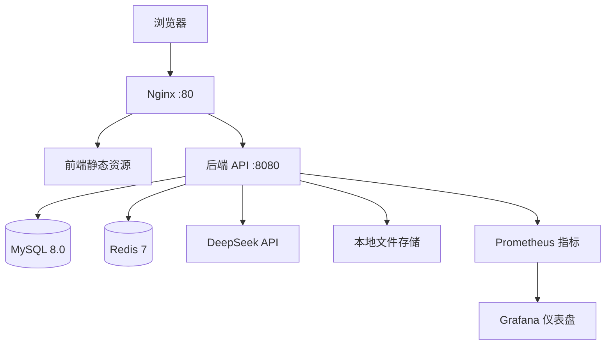

> 后端启动后，API 文档自动生成于 `/api/doc.html`（基于 Swagger/Knife4j）。

## 30 秒快速启动

```bash
# 1. 安装 Docker（如果有则跳过）
curl -fsSL https://get.docker.com | bash

# 2. 下载项目
git clone https://github.com/你的用户名/teaching-system.git
cd teaching-system

# 3. 配置环境变量
cp backend/.env.example .env
# 编辑 .env，填入 JWT_SECRET 和数据库密码

# 4. 启动
docker-compose up -d
```

部署完成后访问 `http://localhost`，默认管理员账号 `admin` / `admin123`。

> 详细部署步骤见 [`docs/部署指南-学校IT版.md`](docs/部署指南-学校IT版.md)

## 教师手册

[`docs/教师使用手册.html`](docs/教师使用手册.html) 可直接在浏览器中打开或打印为 PDF，零技术术语，面向一线教师。

## 开始使用

| 角色 | 默认账号 | 说明 |
|------|---------|------|
| 管理员 | `admin` | 系统配置、教师管理、学生导入 |
| 教师 | 管理员创建 | 任务管理、批改、AI 出题、成绩分析 |
| 学生 | 管理员创建 | 作业提交、考试、错题本 |
| 家长 | 绑定学生 | 查看成绩和作业 |

## 项目结构

```
teaching-system/
├── .github/           # Issue/PR 模板 + CI 流水线 + Dependabot
├── backend/           # Spring Boot 后端
│   ├── src/main/java  # Java 源码
│   └── src/main/resources  # 配置 + Flyway 迁移
├── frontend/          # Vue 3 前端
│   └── src/           # 源码
├── database/          # DDL + 种子数据
├── docker-compose.yml # 一键部署
├── docs/              # 文档 + 截图
├── tools/             # 工具脚本
├── CHANGELOG.md       # 更新日志
├── CONTRIBUTING.md    # 贡献指南
├── CODE_OF_CONDUCT.md # 行为准则
├── SECURITY.md        # 安全策略
└── LICENSE            # AGPL-3.0
```

## 截图

### 教师端

| 页面 | 预览 |
|------|------|
| 登录页 | 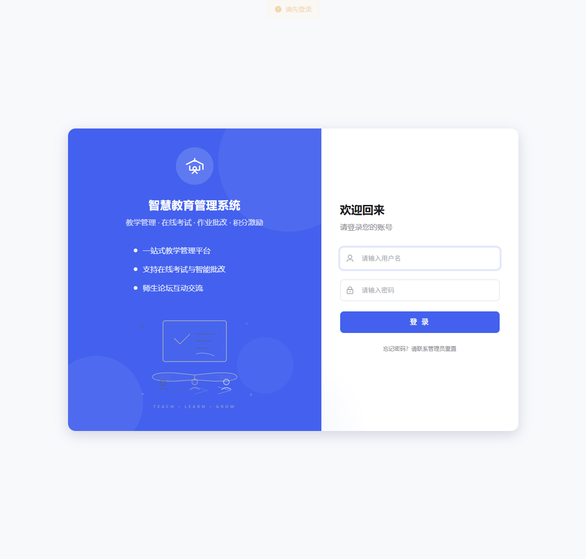 |
| 教师工作台 | 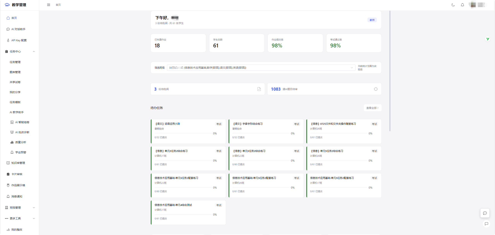 |
| 任务管理 | 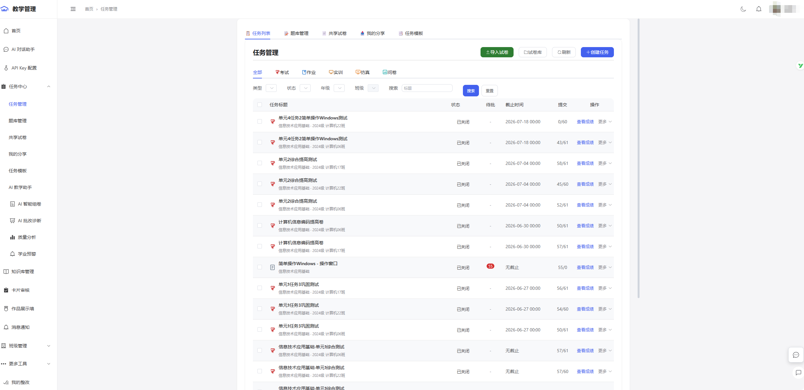 |
| 题库管理 | 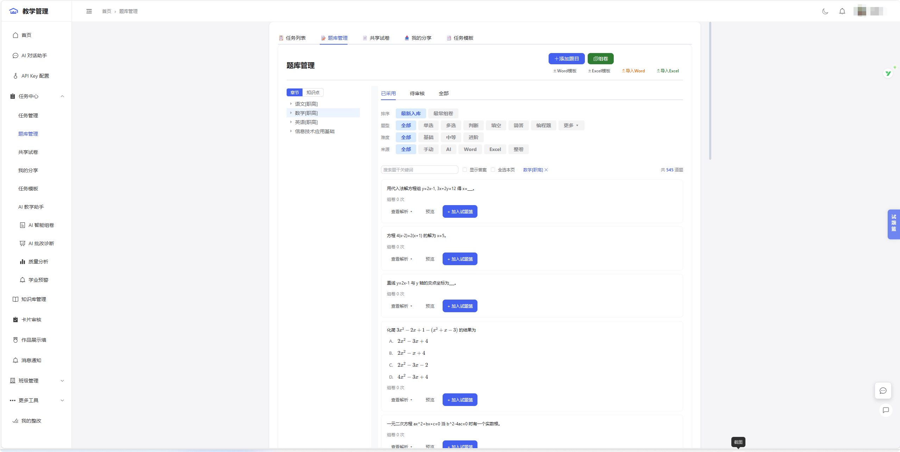 |
| AI 教学助手 | 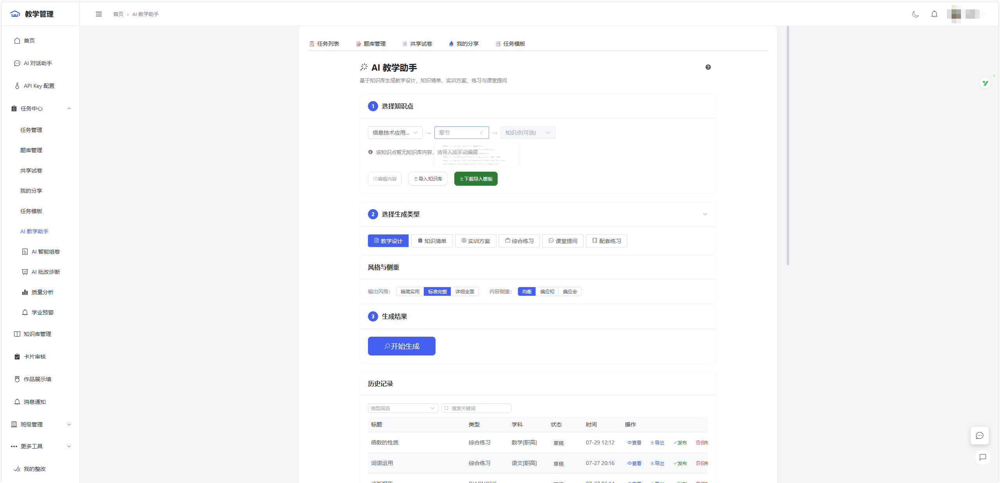 |
| 试卷库 | 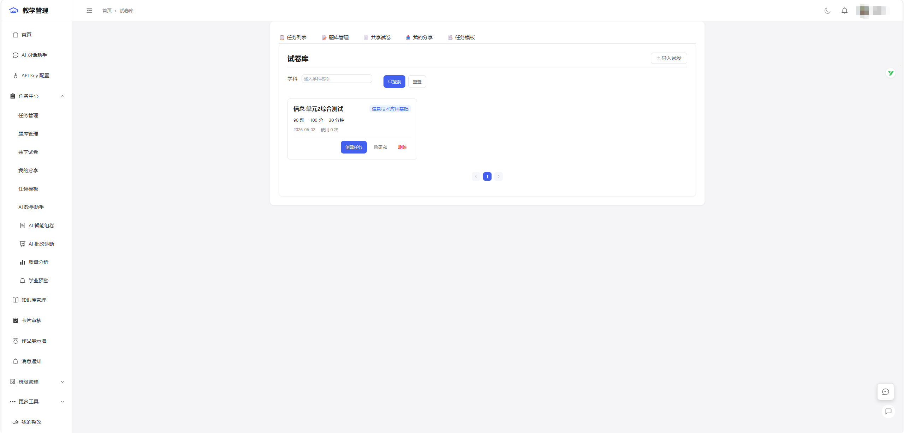 |
| 质量分析 | 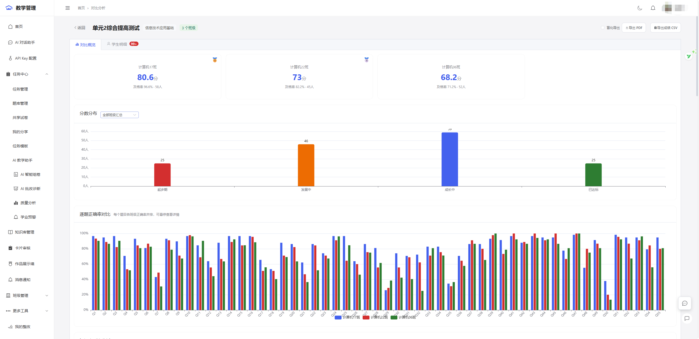 |

### 学生端

| 页面 | 预览 |
|------|------|
| 学生端截图 1 | 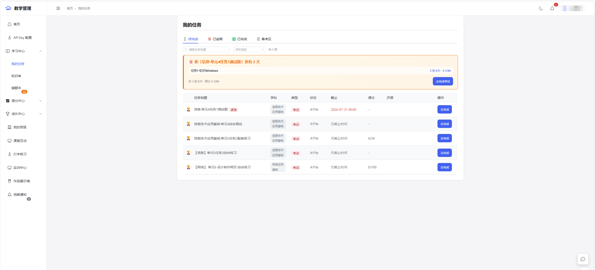 |
| 学生端截图 2 | 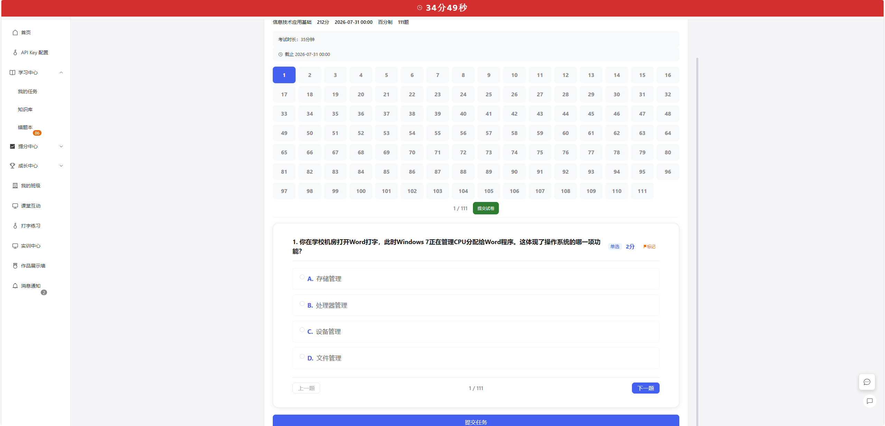 |
| 学生端截图 3 | 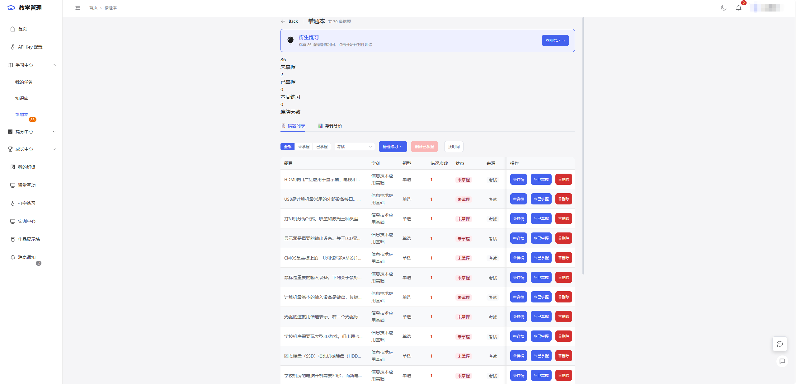 |
| 学生端截图 4 | 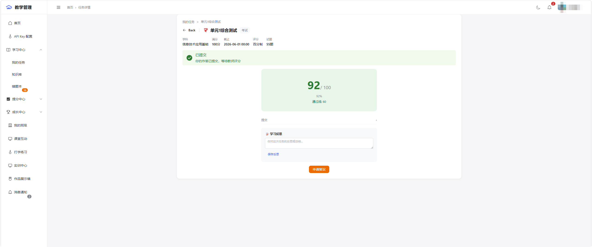 |
| 学生端截图 5 | 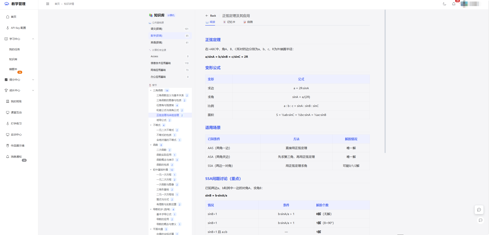 |
| 学生端截图 6 | 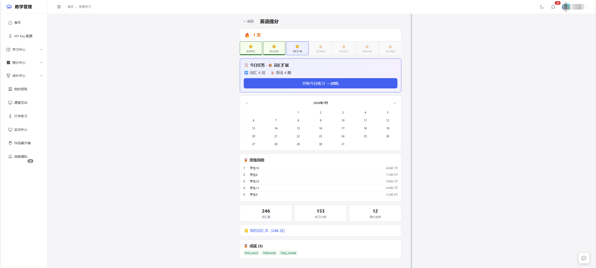 |

## 协议

[AGPL-3.0](LICENSE)

这意味着：
- ✅ 可以自由使用、修改、分发
- ✅ 可以部署在教学环境中，免费使用
- ❌ 如果修改后提供网络服务（如部署为 SAAS），必须开源修改
- ❌ 不能闭源分发或用于商业封装

## 完整数据库（考纲/知识树/题库）

本仓库代码出于隐私考虑不包含题库数据。如需含四川省对口升学考纲对照、知识树、各科目题库的完整数据库包，可在 [GitHub Releases](https://github.com/mvpflk/teaching-system/releases) 下载 `teaching-system-full-data.zip`。

> 数据包免费提供。如果你觉得这个项目对你有帮助，欢迎在 Issues 中留言反馈。

## 贡献

欢迎提交 Issue 和 Pull Request。详见 [`CONTRIBUTING.md`](CONTRIBUTING.md)。

本项目采用 [贡献者公约](CODE_OF_CONDUCT.md)，请所有参与者遵守。

如果你是一线教师，想部署这套系统但遇到困难，请先阅读 [`docs/部署指南-学校IT版.md`](docs/部署指南-学校IT版.md)。如果仍有问题，可以在 Issues 中提问。

> 发现安全漏洞？请阅读 [`SECURITY.md`](SECURITY.md) 了解如何私下报告。

## 关于作者

一线中职教师，零编程基础，利用业余时间从零开发。

如果你也是教师，也想自己动手做点什么——这个项目证明了：一个了解教学的老师 + AI 辅助 = 可以改变教学管理的方式。
